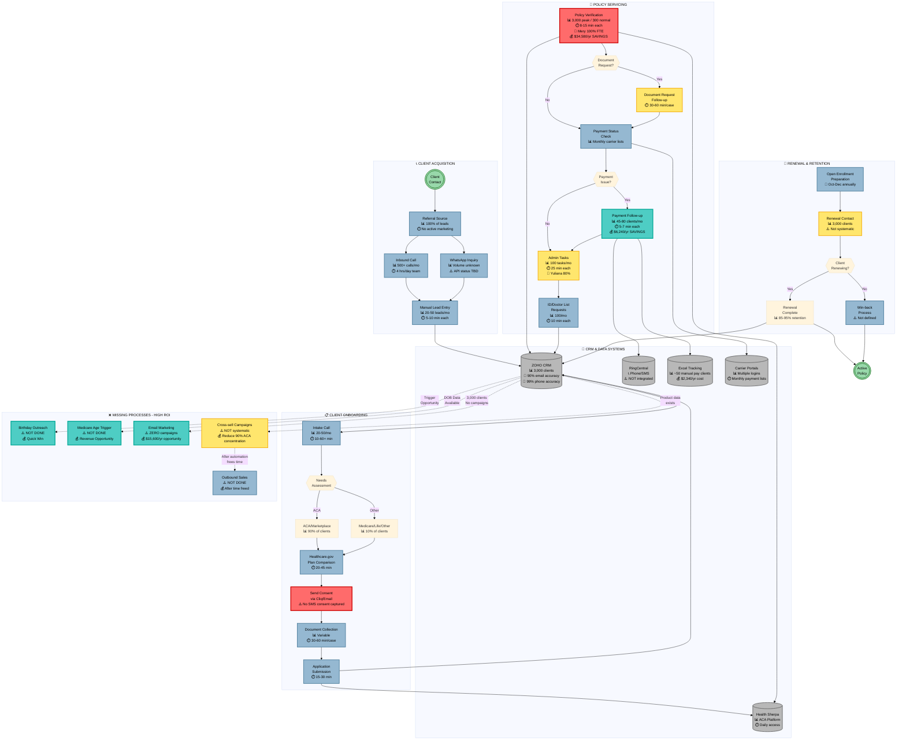

# Aston Insurance Group: Operations Flowchart

**Prepared by:** Systems Architect
**Date:** February 12, 2026

---

## Company Operations & Automation Opportunity Map

---

## Legend

| Color | Meaning | Action Required |
|-------|---------|-----------------|
| 🔴 **Red** | Critical Risk / Compliance Issue | Immediate attention required |
| 🟢 **Teal** | High ROI Opportunity | Prioritize for automation |
| 🟡 **Yellow** | Medium Priority | Include in Phase 2 |
| 🔵 **Blue** | Standard Process | Monitor and optimize |
| 🟣 **Purple** | Already Automated | Maintain |
| ⬜ **Gray** | Database/System | Integration opportunity |

---

## Key Metrics Summary

### Current State Pain Points
- **Policy Verification**: 1 FTE (Mery) = 160 hrs/month during peak
- **Payment Follow-up**: 4-9 hrs/month manual SMS
- **No Marketing**: 0 email campaigns, 0 outbound calls
- **SMS Consent Gap**: Cannot legally do bulk marketing SMS

### Automation ROI Summary
| Process | Annual Savings | Implementation Cost |
|---------|---------------|-------------------|
| Policy Verification RPA | $34,580 | $8,000-$10,000 |
| Payment Follow-up Automation | $6,240 | $2,500-$3,500 |
| Email Marketing Launch | $15,600 (revenue) | $3,000-$4,000 |
| ZOHO Workflow Automation | $10,920 | $3,000-$4,000 |
| **Total** | **$67,340+** | **$18,500-$24,500** |

### Payback Period: **2.8 - 3.7 months**

---

## Recommended Implementation Phases

### Phase 1 (Days 1-30): Foundation
1. ✅ Add SMS consent capture to intake
2. ✅ Implement birthday automation in ZOHO
3. ✅ Implement Medicare age trigger (65)
4. ✅ Create SMS templates for payment reminders

### Phase 2 (Days 31-60): Integration
5. 🔄 RingCentral-ZOHO integration
6. 🔄 Replace Excel tracking with ZOHO
7. 🔄 Build email templates
8. 🔄 Launch first email campaign

### Phase 3 (Days 61-90): Optimization
9. 🚀 Deploy RPA for policy verification
10. 🚀 Document request workflow automation
11. 🚀 Client segmentation for campaigns
12. 🚀 KPI dashboard implementation

---

*This flowchart represents the complete operational view of Aston Insurance Group with automation opportunities highlighted for executive review.*
